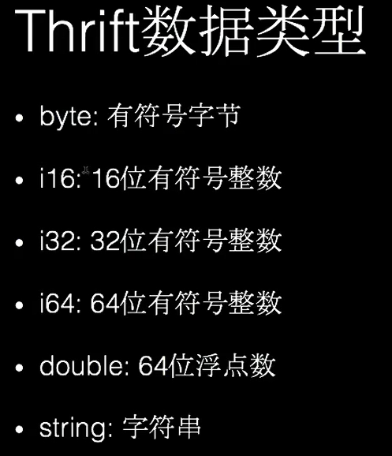
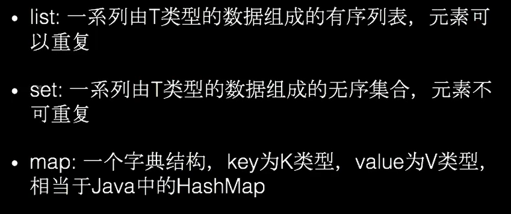
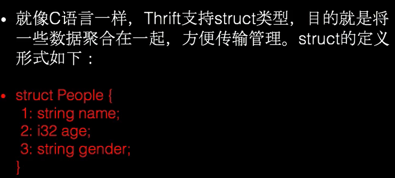
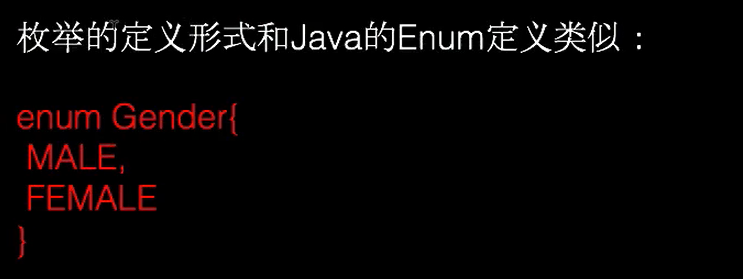
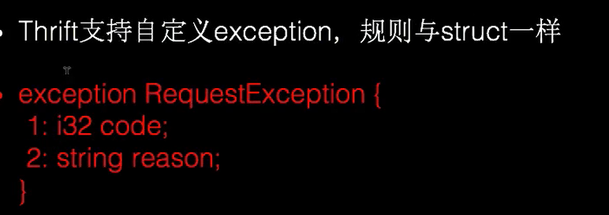

# netty_study
学习netty的NIO编程，包含http，websocket，socket例子，protobuf、thrift和gRPC等

# 使用protobuf
## 1.到['protocolbuffers'](https://github.com/protocolbuffers/protobuf/releases)下载
windows下的编译器 protoc-3.9.0-win64.zip，以及特定的语言编码器protobuf-java-3.9.0.zip
## 2.配置编译器 protoc-3.9.0-win64.zip的环境变量
## 3.到maven仓库里查找protobuf相关插件，引入Gradle中管理(如果序列化不成功可能包不完整)
       dependencies {
           //testCompile group: 'junit', name: 'junit', version: '4.12'
           compile group: 'io.netty', name: 'netty-all', version: '4.1.10.Final'
           compile group: 'com.google.protobuf', name: 'protobuf-java', version: '3.6.1'
           //针对移动端
           compile group: 'com.google.protobuf', name: 'protobuf-java-util', version: '3.9.0'
       }

## 4.编写proto文件 如下
    syntax = "proto3";
    
    package com.xuge.protobuf;
    option optimize_for= SPEED;
    option java_package= "com.xuge.protobuf";
    option java_outer_classname="Datainfo";
    
    message Student{
         string name=1;
         int32 age=2;
         string address=3;
    }
## 5. 使用cmd命令切换到工程目录下，使用命令protoc --java_out= 生成java对象如下
    E:\何旭杰person\nettyIDEA\src>protoc --java_out=main/java/ protobuf/Student.proto

## 6.最后可以使用编码如下例子
    package com.xuge.protobuf;
    
    import com.google.protobuf.InvalidProtocolBufferException;
    
    public class TestProtobuf {
    
        public static void  main(String[]args) throws InvalidProtocolBufferException {
            Datainfo.Student student=Datainfo.Student.newBuilder().setName("张三")
                    .setAge(20).setAddress("北京").build();
            byte[]student2ByteArray=student.toByteArray();
            Datainfo.Student student2=Datainfo.Student.parseFrom(student2ByteArray);
            System.out.println(student2.getName());
            System.out.println(student2.getAge());
            System.out.println(student2.getAddress());
        }
    }
## 2.0单一消息解析如下 使用MyDataInfo.Student.getDefaultInstance()解析对象
     ChannelPipeline pipeline=ch.pipeline();
            pipeline.addLast(new ProtobufVarint32FrameDecoder());
            //解码器
            pipeline.addLast(new ProtobufDecoder(MyDataInfo.Student.getDefaultInstance()));//TestServerHandler
            pipeline.addLast(new ProtobufVarint32LengthFieldPrepender());
            pipeline.addLast(new ProtobufEncoder());
            pipeline.addLast(new TestServerHandler());
## 解析MyDataInfo.Student
    public class TestServerHandler extends SimpleChannelInboundHandler<MyDataInfo.Student> {
    
        @Override
        protected void channelRead0(ChannelHandlerContext ctx, MyDataInfo.Student msg) throws Exception {
            System.out.println(msg);
            System.out.println(msg.getAddress());
            System.out.println(msg.getAge());
        }
    }
 ## 客户端数据的发送
     MyDataInfo.Student student=MyDataInfo.Student.newBuilder().
                    setName("周洁").
                    setAge(21).
                    setAddress("贺州").
                    build();
            ctx.channel().writeAndFlush(student);
## 2.1 多消息message解析方案和编码
    syntax = "proto3";
    
    package sixthExample;
    option optimize_for= SPEED;
    option java_package= "sixthExample";
    option java_outer_classname="MyDataInfo";
    
    message MyMessage{
         enum DataType{
              StudentType =0;
              DogType=1;
              CatType=2;
         }
         DataType data_type=1;
         oneof dataBody{ //oneof多个消息中只能出现一个
              Student student=2;
              Dog dog=3;
              Cat cat=4;
         }
    }
    message Student{
         string name=1;
         int32 age=2;
         string address=3;
    }
    
    message Dog{
         string name=1;
         int32 age=2;
    }
    
    message Cat{
         string name=1;
         string city=2;
    }
## 2.2 客户端和服务端都 改造成MyDataInfo.MyMessage.getDefaultInstance()
    public class TestInitalizer extends ChannelInitializer<SocketChannel> {
        @Override
        protected void initChannel(SocketChannel ch) throws Exception {
            ChannelPipeline pipeline=ch.pipeline();
            pipeline.addLast(new ProtobufVarint32FrameDecoder());
            //解码器
            pipeline.addLast(new ProtobufDecoder(MyDataInfo.MyMessage.getDefaultInstance()));//TestServerHandler
            pipeline.addLast(new ProtobufVarint32LengthFieldPrepender());
            pipeline.addLast(new ProtobufEncoder());
            pipeline.addLast(new TestServerHandler());
        }
    }
##2.3 客户端发送消息方式
     @Override
        public void channelActive(ChannelHandlerContext ctx) throws Exception {
            int randomInt=new Random().nextInt(3);
            MyDataInfo.MyMessage myMessage=null;
            if(randomInt==0){
                 myMessage=MyDataInfo.MyMessage.newBuilder().
                        setDataType(MyDataInfo.MyMessage.DataType.StudentType).
                        setStudent(MyDataInfo.Student.newBuilder().
                                setName("小康").
                                setAge(21).
                                setAddress("贺州").
                                build()).build();
            }else if (randomInt==1){
                myMessage=MyDataInfo.MyMessage.newBuilder().
                        setDataType(MyDataInfo.MyMessage.DataType.DogType).
                        setDog(MyDataInfo.Dog.newBuilder().
                                setName("猫").
                                setAge(10).
                                build()).build();
            }else {
                myMessage=MyDataInfo.MyMessage.newBuilder().
                        setDataType(MyDataInfo.MyMessage.DataType.CatType).
                        setCat(MyDataInfo.Cat.newBuilder().
                                setName("小康").
                                setCity("南宁").
                                build()).build();
            }
            ctx.channel().writeAndFlush(myMessage);
        }
## 2.4 服务端解析消息方式
    
public class TestServerHandler extends SimpleChannelInboundHandler<MyDataInfo.MyMessage> {

    @Override
    protected void channelRead0(ChannelHandlerContext ctx, MyDataInfo.MyMessage msg) throws Exception {

        MyDataInfo.MyMessage.DataType dataType=msg.getDataType();
        if(dataType==MyDataInfo.MyMessage.DataType.StudentType){
            MyDataInfo.Student student=msg.getStudent();
            System.out.println(student.getName());
            System.out.println(student.getAddress());
            System.out.println(student.getAge());
        }else if(dataType==MyDataInfo.MyMessage.DataType.DogType){
            MyDataInfo.Dog dog=msg.getDog();
            System.out.println(dog.getName());
            System.out.println(dog.getAge());
        }else {
            MyDataInfo.Cat cat=msg.getCat();
            System.out.println(cat.getName());
            System.out.println(cat.getCity());
        }

    }
}

#3 使用安装thrift（thrift不支持无符号类型）
 ##3.1到官网[thrift](http://www.apache.org/dyn/closer.cgi?path=/thrift/0.12.0/thrift-0.12.0.exe)下载安装thrift编译器，将thrift.exe路径设置到windows环境变量
 ##3.2  引入thrift-java的插件包
    compile group: 'org.apache.thrift', name: 'libthrift', version: '0.12.0'
 ##3.3 编写thrift文件如下:
    namespace java thrift.generated  //包的名字
    typedef i16 short
    typedef i32 int
    typedef i64 long
    typedef bool boolean
    typedef string String
    
    struct Person{
        1: optional String username,
        2: optional int age,
        3: optional boolean married
    }
    
    exception DataException{
        1: optional String message,
        2: optional String callStack,
        3: optional String date
    }
    
    service PersonService{
        Person getPersonByUsermae(1:required String username)throws (1:DataException dataException),
        void savePerson(1:required Person person)throws(1:DataException dataException)
    }
 ##3.4 使用命令“ thrift --gen 语言 路径”    生成代码
    如下 E:\何旭杰person\nettyIDEA\src\thrift>thrift --gen java data.thrift
 
 ## 3.5 实现service接口
    package com.xuge.thrift;
    import org.apache.thrift.TException;
    import thrift.generated.DataException;
    import thrift.generated.Person;
    import thrift.generated.PersonService;
    
    public class PersonServiceImpl implements PersonService.Iface {
        @Override
        public Person getPersonByUsermae(String username) throws DataException, TException {
            System.out.println("Got Client Param: "+username);
            Person person=new Person();
            person.setUsername(username);
            person.setAge(20);
            person.setMarried(false);
            return person;
        }
    
        @Override
        public void savePerson(Person person) throws DataException, TException {
            System.out.println("Got Client Param: ");
            System.out.println(person.getUsername());
            System.out.println(person.getAge());
            System.out.println(person.isMarried());
            
        }
    }

 ##3.6 编写服务端代码 和客户端代码，详细看com.xuge.thrift
 
 ##3.7总结

 